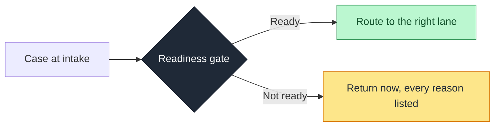

# Manual Review Accelerator

**A design framework for keeping unworkable cases out of manual-review queues.**

   

Operations teams lose review capacity to cases that were never ready to be worked. This documents a rules-based readiness gate that catches them at intake instead.

> *Illustrative operations view. All figures are modeled against synthetic data and shown for layout purposes only.*

---

## The problem

**Most manual-review load is avoidable.**

A case fails automation and lands in a queue. An analyst picks up what looks like a five-minute ticket, finds a missing document or a skipped compliance check, and sends it back. The case round-trips, ages, and re-enters later. The slot was spent discovering a gap, not resolving the case.

**Why it matters:** the waste is not the review. It is the round trip, and the queue space it consumes twice.

## The idea

**Stop incomplete cases before they enter the queue.**

A deterministic readiness gate checks each case for completeness and baseline compliance at intake. Ready cases route to the right lane. Not-ready cases are returned immediately, with every reason listed, before an analyst is involved.

The rules are transparent and auditable by design. No machine learning, no black box, every decision explainable to risk and compliance.

## Two ways cases arrive

**The same problem comes through two doors. The framework handles both.**

|  | Advisor-assisted | Self-guided |
|---|---|---|
| **Who assembles the case** | A trained advisor | The client, alone |
| **Why it fails** | Process slips | Misread requirements |
| **Where the gate sits** | After assembly, before the queue | At the point of entry |
| **What the fix points to** | Coaching and tooling | Form and content design |

## How you would know it works

**Two numbers carry it:**

- **First-time-right rate:** how many cases arrive workable.
- **Avoidable manual touches:** slots spent only to send a case back.

Both are modeled here against synthetic data. Real queue data drops straight in.

## What's inside

- **[Specification](./SPECIFICATION.md)** is the full framework: problem, scope, rule logic, data model, metrics, business case, and rollout.
- **[Advisor-assisted intake](./cases/advisor-assisted-intake.md)** is the human-in-the-loop case.
- **[Self-guided intake](./cases/self-guided-intake.md)** is the self-serve case.

## What this is, and is not

**Is:** a business-analysis and process-design package, with worked decision logic and a measurement framework.

**Is not:** running software. The figures are modeled against synthetic data and labeled as projections, not measured results.

---

## About

Built by Jordan Florence. I work on operational strategy and process optimization: finding where work breaks down, structuring the fix, and making it measurable.

LinkedIn: [jordanflorence](https://www.linkedin.com/in/jordanflorence/)    GitHub: [jordancflorence](https://github.com/jordancflorence) 
