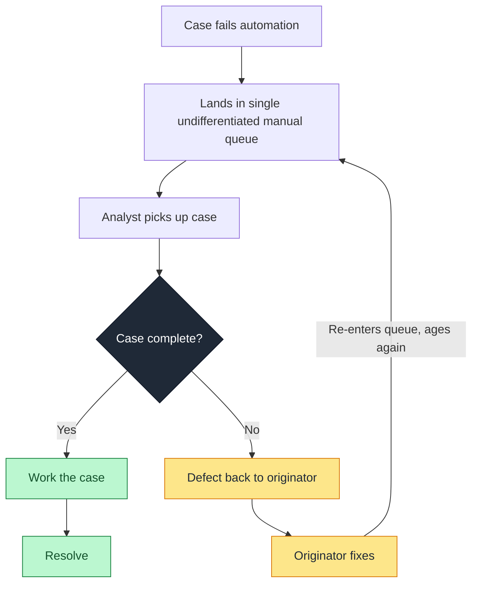
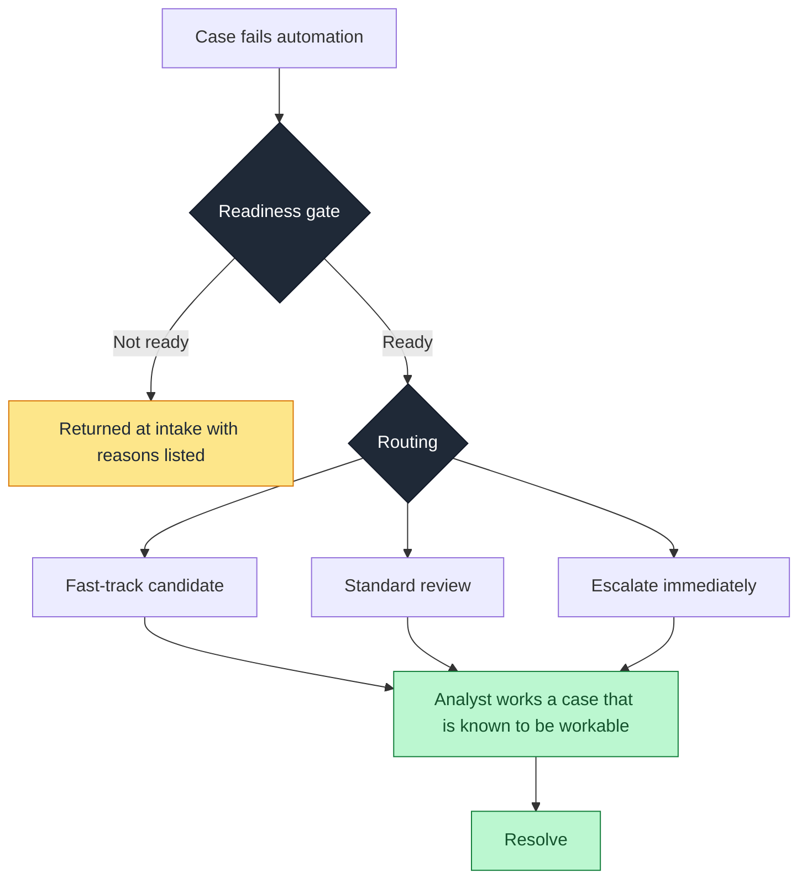
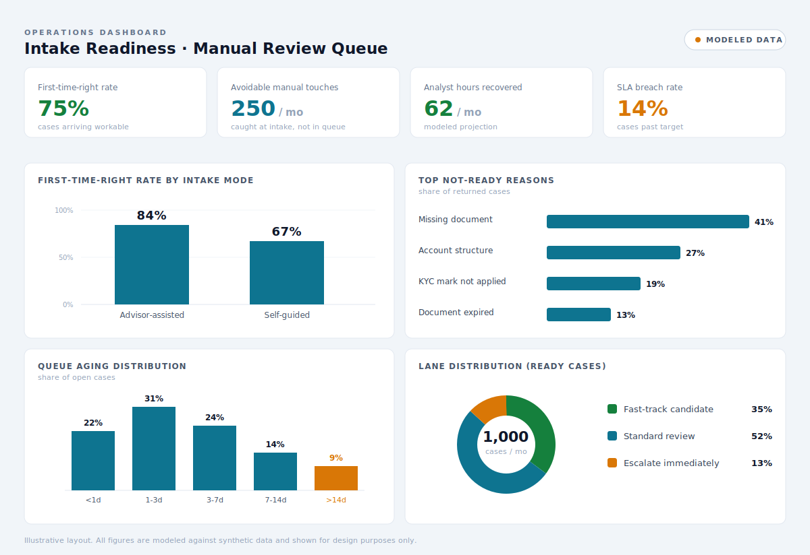

# Manual Review Accelerator

A design specification for an intake-readiness gate that reduces avoidable manual-review load in operational case queues, while preserving control, auditability, and quality.

> This is a business-analysis and process-design package. It documents the problem, the proposed solution, the decision logic, the data model, and the measurement framework. It is not running software, and it does not claim to be. It documents how a real operational inefficiency can be scoped, structured, and made measurable.

---

## What this is, and what it is not

**It is:** a worked specification for a decision-support layer that checks whether a case is ready to be worked *before* it enters a manual-review queue, routes it to the correct lane, records the reason for every decision, and measures where manual effort and delay actually concentrate.

**It is not:** a machine-learning classifier, a production application, or a system that takes any action on its own. Every disposition in this design is produced by transparent, auditable business rules that a person can read and explain. The tool recommends and flags. A human still confirms.

This scope is deliberate. In a regulated operations environment, an explainable rule-based layer is the correct design, because every decision has to be defensible to risk and compliance. Auditability is the requirement, not a limitation.

---

## The problem

Teams that work an exception or case queue tend to treat every case the same way, regardless of whether it is ready to be worked. The expensive failure is not the review itself. It is that cases enter the queue *unfit to be reviewed*.

An analyst picks up what looks like a five-minute ticket. They discover a document is missing, or a baseline compliance check was never satisfied. The case cannot be completed, so it gets defected back to the originating party to be fixed. It then round-trips, ages, and re-enters the queue later. An analyst slot was consumed to discover a gap that a checklist could have caught at intake.

This pattern shows up across business onboarding and credit fulfillment operations. In one operations role anchoring this design, close to 30% of pre-approved credit deals required manual review because no automated baseline check existed upstream. A recurring share of those cases arrived incomplete: a missing document, an account that was not structured correctly, a compliance mark that was never applied. The review team absorbed the cost of catching gaps that should have been caught before the case ever reached them. The result was delayed release of funds, a degraded client experience, and a queue that backed up under its own rework.

The same disease appears in business-registration and account-opening backlogs: tickets that failed automated processing land in a manual queue, and a meaningful fraction of them are not genuinely complex. They are simply incomplete.

The core insight: **a large share of manual-review load is avoidable, because cases that cannot be worked yet should never have entered the queue.** Routing and triage operate on cases that are already ready. The higher-value intervention is upstream of that.

---

## Intake modes

The same problem arrives through two very different doors, and a framework that only handles one of them solves half the problem. This design treats both as first-class.

**Advisor-assisted intake (human in the loop).** A trained intermediary, for example a relationship or business advisor, collects the documentation and assembles the file on the client's behalf before it enters the queue. There is a knowledgeable person in the loop, and cases still arrive not-ready: a document is omitted, an account is structured under the wrong product, a baseline check is skipped. These are process-compliance errors made by someone who knows the requirements, which means the failure points at the process and the tooling around the advisor, not at the advisor's understanding.

**Self-guided intake (self-serve).** The client assembles the file themselves through a platform, asynchronously, with no intermediary. Cases arrive not-ready because the client does not interpret the requirements the way the process expects: they upload the wrong document, misread a question, or skip a step they did not realize applied to them. The failure points at how the requirements were presented, not at a person's diligence.

**What is shared, and what is not.** The underlying requirements are identical across both modes. A file either contains what it needs or it does not, and the readiness rules, the routing logic, the data model, and the metrics in the rest of this document are written to be mode-agnostic. What changes between the two modes is operational, not logical:

| Dimension | Advisor-assisted | Self-guided |
|-----------|------------------|-------------|
| Who assembles the case | Trained advisor | The client, unassisted |
| Nature of the error | Process-compliance slip | Misread requirement |
| Best place for the gate | After assembly, before the queue | At the point of entry, with a backstop before the queue |
| Who the return goes to | The advisor | The client |
| Language of the reason | Procedural, written for a trained recipient | Plain language, written for a non-expert |
| What recurring errors reveal | A coaching or tooling gap | A form or content design gap |

The single most important difference is where the gate sits. For advisor-assisted intake, the gate checks a file that is already assembled. For self-guided intake, the highest-value placement moves the check to the moment of input, so a client is told what is missing while they can still fix it, rather than after a submission has been created and queued. Catching the error before the bad case exists is more valuable than catching it after.

These two modes are documented in detail as companion cases in this repository: `cases/advisor-assisted-intake.md` and `cases/self-guided-intake.md`. Each instantiates the shared framework for one intake topology and follows the same structure so the two can be read side by side.

---

## Users

**Primary user:** an operations team lead or process analyst who owns a case queue and is accountable for its SLA and throughput. They use the reporting to see where avoidable effort and delay concentrate, and to make staffing and prioritization decisions.

**Secondary users:**
- The analysts working the queue, who receive a readiness verdict and a recommended lane with the reason attached, so they are not the ones discovering gaps.
- The operations manager, who needs bottleneck and aging data for capacity planning.

The routing, reporting, and queue management in this design are internal operations tooling. In self-guided intake, the readiness check also has a client-facing surface at the point of entry, where it returns plain-language guidance rather than internal disposition data. That surface is covered in the self-guided case.

---

## Scope

### In scope (MVP)

1. **Case intake** from a structured source representing the queue.
2. **A readiness check** that evaluates each case against a set of completeness and baseline-compliance rules before it is allowed into manual review, and returns a verdict: ready, or not-ready with the specific reasons listed.
3. **Three-lane routing** for cases that pass the readiness check: fast-track candidate, standard review, or escalate immediately.
4. **A decision log** so every case carries a stored, human-readable reason for both its readiness verdict and its lane.
5. **Queue assignment** to a named queue or owner.
6. **SLA and aging tracking**: a target, elapsed time, and breach flag per case.
7. **A reporting view** covering first-time-right rate, avoidable manual touches, lane distribution, aging buckets, and the top reasons cases are sent back.

### Out of scope (named on purpose)

- Machine-learning classification of any kind.
- Real-time ingestion or streaming.
- Write-back into source systems.
- Any automated execution of an action on a case.
- User authentication and access control.

Naming the non-goals is part of the design. It signals that the scope was a decision, not an oversight.

---

## Current state versus proposed state

### Current state

Every case receives full analyst attention regardless of readiness. Gaps are discovered late, by the most expensive resource in the process, and the round trip consumes a queue slot twice.

### Proposed state

The readiness gate moves gap-detection to intake, where it is cheap, and removes incomplete cases from the queue before they consume review capacity. Routing then operates only on cases that are actually ready to be worked.

The proposed state adds a checkpoint, not a hard stop. A not-ready verdict is a fast, reasoned return to the originator, not a rejection of the underlying case.

---

## Readiness rule logic

The readiness gate is a deterministic decision table. Each rule is a plain-language condition with a verdict and a reason. Rules are evaluated in order. The first blocking condition that fires produces a not-ready verdict with that reason recorded. If no blocking condition fires, the case is ready.

These are illustrative rules for a credit-fulfillment-style queue. They are written to be read by a non-technical reviewer, which is the point.

| # | Condition | Verdict | Recorded reason |
|---|-----------|---------|-----------------|
| 1 | A required document for the case type is missing | Not ready | Missing required document: [name] |
| 2 | The account is not structured correctly for the product | Not ready | Account structure does not match product requirements |
| 3 | A required baseline compliance mark is absent | Not ready | Baseline compliance check not satisfied: [check] |
| 4 | Submitted document is present but past validity (for example, expired) | Not ready | Document present but expired: [name] |
| 5 | All required documents present, account structured correctly, all baseline marks satisfied | Ready | Passed all readiness checks |

A case can fail more than one rule. The design records all failed conditions, not just the first, so the return to the originator is complete and the case does not bounce a second time for a different reason. Catching every gap in one pass is the entire value of the gate.

### Routing rules (applied only to ready cases)

| # | Condition | Lane | Rationale |
|---|-----------|------|-----------|
| 1 | Industry is on the high-risk or prohibited list, or sanctions/watchlist signal present | Escalate immediately | Requires senior or compliance review before any processing |
| 2 | Case requires a policy or legislative interpretation not covered by standard procedure | Escalate immediately | Outside the bounds of routine review |
| 3 | Low exposure, standard case type, no risk signals, no prior exception on file | Fast-track candidate | Low-risk; suitable for expedited handling |
| 4 | Anything else that passed the readiness gate | Standard review | Default lane; receives normal manual review |

Rule 4 is the catch-all. Tracking how many cases land there (rule coverage) shows how much of the queue the specific rules actually explain, and where new rules would add value.

A fast-track candidate is a recommendation for expedited handling. It is not auto-approval. A human still confirms the disposition. This is a deliberate design choice: the tool never closes the loop on its own.

---

## Worked walkthrough

The table below runs a small set of deliberately constructed cases through the logic. These are not random sample rows. Each case is built to exercise one specific rule, so the set as a whole proves the logic is unambiguous and produces the right verdict and reason for every condition it is meant to handle.

It functions as the implementation specification. By stating the expected output for every input, it makes the rules testable rather than open to interpretation, which is the difference between a logic model that can be built from directly and a prose description that has to be guessed at.

| Case | Inputs (abbreviated) | Rule fired | Verdict | Recorded reason | Lane |
|------|----------------------|-----------|---------|-----------------|------|
| C-01 | Standard case, articles of incorporation missing | Readiness #1 | Not ready | Missing required document: articles of incorporation | (returned at intake) |
| C-02 | Account opened under wrong product structure | Readiness #2 | Not ready | Account structure does not match product requirements | (returned at intake) |
| C-03 | All docs present, KYC mark never applied | Readiness #3 | Not ready | Baseline compliance check not satisfied: KYC | (returned at intake) |
| C-04 | Required ID present but expired | Readiness #4 | Not ready | Document present but expired: government ID | (returned at intake) |
| C-05 | Missing document AND wrong account structure | Readiness #1 and #2 | Not ready | Two reasons recorded: missing document; account structure mismatch | (returned at intake) |
| C-06 | Complete, low exposure, no risk signals, no prior exception | None blocking | Ready | Passed all readiness checks | Fast-track candidate |
| C-07 | Complete, standard case, one prior exception on file | None blocking | Ready | Passed all readiness checks | Standard review |
| C-08 | Complete, business in a high-risk industry | None blocking | Ready | Passed all readiness checks | Escalate immediately |
| C-09 | Complete, requires interpretation of acceptable-conditions legislation | None blocking | Ready | Passed all readiness checks | Escalate immediately |
| C-10 | Complete, mid exposure, no risk signals, no specific rule matches | None blocking | Ready | Passed all readiness checks | Standard review (default lane) |

Two cases are worth pointing at directly. **C-05** demonstrates the multi-reason behavior: both gaps are caught and recorded in one pass, so the case is returned once with a complete list rather than bouncing twice. **C-10** lands in the default lane because no specific routing rule matched it. That is not a failure, it is a measurement: cases like C-10 are what the rule-coverage metric counts, and a cluster of them is the signal to write a new rule.

---

## Data model

One record per case. Synthetic data only, clearly labeled, designed to mirror a realistic distribution: a large share of low-complexity cases, a meaningful share with completeness gaps, and a long tail of genuinely complex and escalation-worthy cases.

| Field | Type | Purpose |
|-------|------|---------|
| case_id | string | Unique identifier |
| received_at | datetime | When the case entered the queue |
| resolved_at | datetime | When the case was closed (null if open) |
| case_type | category | The kind of case (drives which documents are required) |
| channel | category | Where the case originated |
| intake_mode | category | advisor_assisted / self_guided (drives where the gate sits and who the return goes to) |
| originator_id | string | The advisor who assembled the case, or the client who submitted it, depending on intake_mode. Used to route the return and to analyze error patterns by source |
| exposure_amount | number | Financial exposure, used for risk and lane logic |
| customer_segment | category | Segment, used for risk context |
| required_documents | list | Documents required for this case type |
| documents_present | list | Documents actually submitted |
| account_structured_correctly | boolean | Baseline check signal |
| compliance_marks_present | list | Baseline compliance marks satisfied |
| high_risk_industry | boolean | Drives escalation routing |
| prior_exception_on_file | boolean | Risk and lane context |
| readiness_verdict | category | ready / not_ready (output) |
| readiness_reasons | list | All conditions that produced the verdict (output) |
| recommended_lane | category | fast_track / standard / escalate (output) |
| assigned_queue | string | Named destination queue (output) |
| sla_target_hours | number | Target for this case type |
| handle_time_minutes | number | Time an analyst spent, where applicable |
| analyst_disposition | category | Ground-truth label: what a human actually decided |

The `analyst_disposition` field is the most important design choice in the data model. It is the human-decided outcome, held separately from the rule output. It is what lets the project report honestly on how well the rules agree with human judgment, rather than asserting the rules are correct. Without it there is no way to measure quality, only to claim it.

---

## Success metrics

These are the numbers that would prove the design is worth implementing. In this package they are computed against synthetic data, so every figure derived from them is a model, not an observed result.

**Headline metrics**

- **First-time-right rate:** the share of cases that arrive complete and workable, versus cases that have to be defected back. This is the number the readiness gate is built to move, and the number that quietly drives queue backlog.
- **Avoidable manual touches:** cases that would consume an analyst slot only to be sent back, and that the readiness gate catches at intake instead. This is the direct measure of waste removed.

**Supporting metrics**

- **Fast-track candidate rate:** share of ready cases the rules can safely recommend for expedited handling.
- **Average handle time by lane:** shows where analyst effort concentrates.
- **Queue aging distribution and SLA breach rate:** how long cases sit, and how often the target is missed.
- **Rule coverage:** share of cases matched by a specific rule versus falling through to the default lane. Low coverage points to where new rules are needed.
- **Escalation leakage:** high-risk cases the escalation rules failed to flag, measured against the `analyst_disposition` labels. For a rules engine, coverage and leakage are the honest way to describe quality. "Routing accuracy" overstates what a rule table can claim.
- **First-time-right rate by intake mode and originator:** the same headline metric sliced by `intake_mode` and `originator_id`. This is where the two intake modes diverge in practice. In advisor-assisted intake, a recurring error concentrated on a few originators points to a coaching or tooling gap. In self-guided intake, a recurring error concentrated on a single form field or step points to a content or design gap. The metric is the same; the upstream fix it implies is different, and slicing it this way is what surfaces that.

**Modeled time saved**

Calculated as avoidable manual touches multiplied by average manual handle time. Always reported as a projection, never as hours actually saved. A proof-of-concept on synthetic data cannot claim real recovered time, and stating that plainly is what keeps the figure credible.

**Dashboard layout (illustrative)**

The metrics above are the panels of an operational view. The mock below shows how they would sit together for a queue owner: headline numbers across the top, first-time-right split by intake mode, the leading not-ready reasons, queue aging, and lane distribution. All figures are modeled against synthetic data and shown for layout purposes only.

---

## The business case

This section makes the case for building the gate: the cost of the current state, the smallest sufficient fix, and what it would take to ship. It is written to support a prioritization decision, so it stays concise, quantified where the data honestly allows, and explicit about what it asks of each team involved.

### The argument in three lines

Manual-review capacity is being spent on cases that were never workable. Every incomplete case that reaches the queue consumes an analyst slot, gets sent back, and re-enters later, which means the same case is handled more than once and the backlog compounds. A deterministic readiness check at intake removes that rework by catching gaps before a case is queued, which recovers capacity without adding headcount.

### Sizing the opportunity (illustrative, to be confirmed with real data)

The numbers below are a worked example of how the case would be sized, using placeholder inputs. They are not measured results. In a real engagement, the first step is replacing these with two or three weeks of actual queue data.

| Input | Placeholder value | Source in a real engagement |
|-------|-------------------|-----------------------------|
| Cases entering manual review per month | 1,000 | Queue system export |
| Share arriving incomplete (defected back) | 25% | Sample audit of returned cases |
| Analyst time spent before a case is defected | 15 min | Time study or system timestamps |
| Fully loaded analyst cost per hour | (to confirm) | Finance |

Applied to the placeholders: roughly 250 cases a month are touched only to be returned, at about 15 minutes each, which is approximately 62 analyst-hours a month spent discovering gaps that a readiness check catches at intake. That recovered capacity is the headline of the case. Every figure here is modeled from placeholder inputs and would be restated against real data before anyone acted on it.

### What is being asked for, and from whom

The readiness gate is a small build, but it does not ship in isolation. The business case names where it sits in the pipeline and who has to align:

- **Engineering** builds the gate as a deterministic rule service that runs after automated processing fails and before a case is queued. The worked walkthrough is the input that makes this buildable: it specifies expected output for every rule.
- **Data Science** is consulted on where rule-based logic is sufficient and where a case genuinely needs a model later. The honest division of labor (rules now, models only where they earn their place) is part of the pitch, not a concession.
- **Product** owns where the readiness verdict surfaces to the originator, so a returned case comes back with a complete, actionable list rather than a vague rejection.
- **Operations and Compliance** validate the rules and own the requirement that every disposition stays explainable and auditable.

### Why the case is structured this way

The case leads with a quantified problem, proposes the smallest sufficient intervention rather than the most sophisticated one, draws an honest line between what rules can do and what a model would be needed for, and names the cross-functional alignment required to ship it. The underlying argument is to fix the problem systemically at intake rather than absorbing it with more manual QA downstream.

---

## Rollout plan

The design adds a checkpoint to an existing process, so it can be introduced incrementally rather than as a single change. The sequence below prioritizes measuring the gate before trusting it.

1. **Validate the rules with the people who work the queue.** The decision tables are only as good as the operational reality behind them. Sit with analysts, confirm which gaps actually recur, and adjust the rules to match.
2. **Run the gate in shadow mode.** Apply the readiness check to incoming cases without changing routing, and compare its verdicts to what analysts find. Measure escalation leakage and false not-ready rates before anything is enforced.
3. **Enable the gate for low-risk case types first.** Start where the cost of a wrong verdict is lowest. Expand coverage as confidence builds.
4. **Keep a human confirmation step on every fast-track and escalation recommendation.** The tool never closes the loop on its own.
5. **Review rule coverage and leakage on a set cadence.** Add rules where cases keep landing in the default lane, and tighten escalation rules wherever leakage appears.

The shadow-mode step is deliberate. In a regulated environment, a control is measured before it is trusted.
