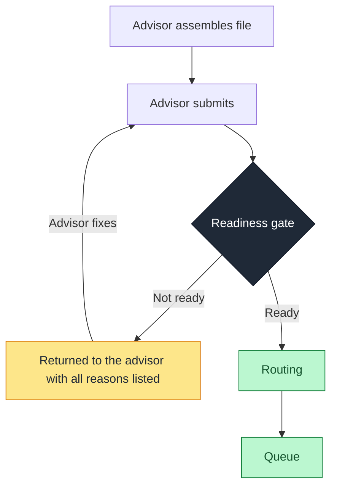

# Advisor-Assisted Intake

How the readiness gate applies when a trained intermediary assembles the case before it enters the manual-review queue.

> This is a companion case to the main [specification](../SPECIFICATION.md). It instantiates the shared framework for one intake topology. The self-guided counterpart is in [`self-guided-intake.md`](./self-guided-intake.md), and the two follow the same structure so they can be read together.

---

## Context

In advisor-assisted intake, a trained intermediary, for example a relationship or business advisor, gathers the required documentation from the client, assembles the file, and submits it into the operations queue. There is a knowledgeable person in the loop who understands the requirements and does the work of preparing the case.

This is the model behind much of the credit-fulfillment work that anchors this design. Advisors collected and submitted files, and a downstream operations team worked them. The presence of a trained person at the front of the process is the defining feature of this mode, and it shapes both how errors happen and how they should be caught.

---

## How cases arrive not-ready

The intuition is that a trained advisor should produce a complete file. In practice, a recurring share of cases still arrive not-ready, and the reasons are structural rather than a matter of individual competence:

- A required document for the specific case type is omitted. Requirements vary by product and case type, and the ones that apply less often are the ones most easily missed.
- The account is structured under the wrong product, so a baseline check that depends on correct structure cannot pass.
- A baseline compliance mark is skipped, often because nothing in the submission step forces it to be present before the file moves forward.

These are process-compliance errors. The advisor knows what the requirement is; the process simply does not stop an incomplete file from being submitted. Under volume pressure, with requirements that differ across case types and no systematic check between submission and the queue, gaps get through. The cost lands downstream: an analyst picks up the file, discovers the gap, and defects it back, and the case round-trips.

The important framing is that a recurring error here is not an argument that advisors are careless. It is evidence that the process and the tooling around the advisor allow the error to happen.

---

## Where the gate sits

For this mode, the gate sits between advisor submission and the queue. It checks the assembled file against the requirements for its case type before the file is allowed to consume a review slot.

The file is already assembled at this point, so the gate is checking a finished package. This is the natural placement when a competent intermediary has done the assembly: the question is not whether the person understood the requirement, but whether the submitted file actually satisfies it.

---

## The return path and the language of the reason

A not-ready file returns to the advisor who submitted it, identified by `originator_id`. Because the recipient is trained, the reason can be stated in procedural terms:

- "Missing required document: articles of incorporation"
- "Account structure does not match product requirements"
- "Baseline compliance check not satisfied: KYC"

The advisor can act on these immediately. The value of the return is speed and completeness: it reaches the right person before an analyst is involved, and it lists every gap at once so the file does not bounce a second time for a different reason.

---

## What the error patterns reveal

This is where advisor-assisted intake produces its most useful signal. Because every not-ready case is attributed to an originator and a missed requirement, the patterns point directly at the upstream fix:

- A specific requirement missed repeatedly across many advisors usually means the requirement itself is unclear, or the submission tooling makes it easy to skip. The fix is a process or tooling change, not coaching.
- A pattern concentrated on a small set of originators points to a targeted coaching or onboarding gap for those individuals.
- A case type with a consistently high not-ready rate points to a checklist or submission-step change for that type.

In every case the readiness gate does two jobs. It stops the bad file from entering the queue, and it generates the data that tells the organization where to fix the process so fewer bad files are produced in the first place.

---

## Worked example

An advisor assembles and submits a business-account file. The articles of incorporation are not attached.

**Current state:** the file enters the queue. Hours or days later, an analyst picks it up, finds the missing document, and defects it back to the advisor. The slot is consumed, the case ages, and it re-enters the queue after the advisor responds.

**With the gate:** at submission, the readiness check finds the missing document and returns the file to the advisor immediately with the reason listed. No analyst slot is consumed. The advisor attaches the document and resubmits. If the same advisor or the same case type shows this gap repeatedly, it surfaces in the pattern reporting as a candidate for a process fix.

---

## Mode-specific metrics

Alongside the shared metrics in the main specification, this mode tracks:

- **Advisor first-time-right rate:** share of submitted files that pass the gate on first submission, overall and by originator.
- **Defect-back-to-advisor rate:** share of files returned at the gate, which replaces the more expensive downstream defect-back-from-analyst.
- **Top missed requirements:** the requirements most often responsible for a not-ready verdict, ranked. This is the direct input to process and tooling fixes.
- **Originator-level patterns:** not-ready concentration by `originator_id`, used to distinguish a coaching gap from a process gap.
