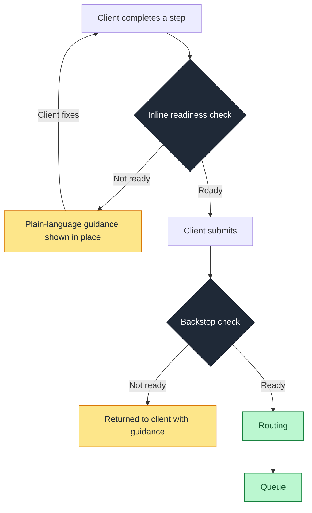

# Self-Guided Intake

How the readiness gate applies when the client assembles the case themselves through a self-serve platform, with no intermediary.

> This is a companion case to the main [specification](../SPECIFICATION.md). It instantiates the shared framework for one intake topology. The advisor-assisted counterpart is in [`advisor-assisted-intake.md`](./advisor-assisted-intake.md), and the two follow the same structure so they can be read together.

---

## Context

In self-guided intake, the client completes the application themselves through a self-serve platform, asynchronously, with no trained intermediary collecting documents or assembling the file. Most cases pass through automated processing and never need a person. The ones that fail automation land in a manual-review queue, and a meaningful fraction of those are not genuinely complex. They are incomplete because the client did not assemble the file the way the process expects.

This is the model behind self-serve business-registration and account-opening flows. The absence of an intermediary is the defining feature of this mode, and it changes where the gate has to sit and how it has to speak.

---

## How cases arrive not-ready

The client is not a trained operator and is not expected to be. Errors here come from the gap between what the process requires and what the client understands it to require:

- The client uploads a document that does not meet the requirement, because nothing told them what a valid version looks like.
- The client misreads a question and answers the wrong thing, or answers correctly but does not realize a follow-up document is now needed.
- The client skips a step they did not realize applied to their situation.

None of these are diligence failures. They are comprehension gaps, and a comprehension gap is a signal about how the requirement was presented, not about the client. When many clients make the same error at the same step, the step is the problem.

Because there is no intermediary, nothing catches these errors before submission. The incomplete case is created, fails automation or review, and the client is contacted later to fix it. The round trip is longer and more damaging here than in advisor-assisted intake, because the person who has to fix it is the client, and each round trip is a point where the client can disengage entirely.

---

## Where the gate sits

For this mode, the highest-value placement moves the gate to the point of entry. Instead of checking a finished submission, the readiness check runs inline as the client completes each step, with a second backstop check before any case that still gets through enters the queue.

The reason for shifting left is simple: catching the error while the client is still in the flow, with the relevant step in front of them, prevents the bad case from ever being created. Catching it after submission means the case exists, has to be queued or held, and the client has to be pulled back into a process they have already left. The inline check is the placement that actually removes the work, not just relocates it.

### Hard requirements versus soft flags

A self-serve gate has a tension the advisor-assisted gate does not: too strict, and clients are blocked and abandon the flow; too loose, and incomplete cases get through. The design handles this by separating two kinds of check:

- **Hard requirements** block progression. A genuinely required document that is absent or invalid stops the client from submitting, because submitting would guarantee a not-ready case.
- **Soft flags** warn but allow. Where something is likely wrong but not certain, the client is shown a prompt and allowed to proceed, so the gate does not punish edge cases or trap people in false negatives.

This separation keeps the gate from becoming a source of abandonment while still preventing the errors that are certain to cause rework.

---

## The return path and the language of the reason

The return goes to the client, and this is the sharpest difference from advisor-assisted intake. A procedural reason is useless to a client. "Baseline compliance check not satisfied: KYC" tells them nothing they can act on. The reason has to teach:

- Not "Missing required document: government ID," but "We need a photo of your government ID. Make sure all four corners are visible and the text is readable."
- Not "Account structure does not match product requirements," but a question rephrased so the client selects the correct option in the first place.

The reason is part of the product surface, not an internal log entry. Its job is to close the comprehension gap that caused the error, so the client gets it right on the next attempt rather than guessing again.

A note on scope: the client-facing check handles completeness and document validity. Risk-based routing, such as identifying a high-risk industry, stays internal and happens after the case is complete. A client cannot reliably self-identify into an escalation lane, and asking them to would be both unreliable and inappropriate. The gate at the client surface is a completeness check, not a risk check.

---

## What the error patterns reveal

Because each error is attributed to a specific form field or step, the patterns point at the product, not the people:

- A field or step that generates errors across many clients is a design or content problem. The fix is rewording the question, adding an example, or restructuring the step, and it belongs on a product backlog.
- A document type that is frequently uploaded invalid usually means the requirement was never made concrete. Showing an example of a valid version often resolves it.
- A high abandonment rate at a particular gated step is a signal that the gate is too aggressive there, or the requirement is too hard to satisfy in the moment, and needs design attention.

The reporting turns a queue of incomplete cases into a prioritized list of product improvements. Every recurring client error is a place the experience can be fixed so the error stops happening, which is a more durable solution than catching it case by case.

---

## Worked example

A client completing a business registration uploads a document for a required field, but the document does not satisfy the requirement.

**Current state:** the submission is accepted. It fails automated processing and lands in the manual queue. Days later, an analyst or an automated message tells the client the document was insufficient. The client, who has moved on, has to return, work out what was wrong, and resubmit. Some do not return at all.

**With the inline gate:** at the upload step, the readiness check finds the document does not meet the requirement and shows the client plain-language guidance in place, with an example of what a valid version looks like. The client corrects it before moving on. The incomplete case is never created. If many clients fail at this same step, it surfaces in the pattern reporting as a candidate for a content or design change to the step itself.

---

## Mode-specific metrics

Alongside the shared metrics in the main specification, this mode tracks:

- **Submission completeness rate:** share of submissions that arrive ready, the self-guided equivalent of first-time-right.
- **Inline catch rate:** share of errors caught at the point of entry versus after submission. A rising inline catch rate is the direct measure of the shift-left working.
- **Error rate by field and step:** errors attributed to each part of the flow, ranked. This is the direct input to the product backlog.
- **Gated-step abandonment:** drop-off at each hard-requirement gate, watched to ensure the gate is preventing rework without driving clients away.
